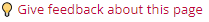

# Data Privacy Handbook

  

## ✨Welcome!✨

The Data Privacy Handbook is a guide to handling personal data in scientific research, in line with European data protection and privacy regulations. 

You can find the Handbook here: https://utrechtuniversity.github.io/dataprivacyhandbook/. You are currently viewing the GitHub repository that underlies the Handbook - this is where the Handbook is built and maintained. 

## Table of Contents
- [About the Handbook](#about-the-handbook)
- [Contribute](#contributing)
- [License & Citation](#license-and-citation)
- [Wiki](#wiki)
- [Contributors ✨](#contributors-)

## About the Handbook

The Data Privacy Handbook is an open-source, community-driven, _living_ Handbook.  

- 🤝 As an _open-source_, _community-driven_ Handbook, anyone can get involved and contribute! You'd help us build something that is hopefully useful to many.  
- 🌱 As a _living_ Handbook, the content can be continually edited and updated. 

The Data Privacy Handbook consists of: 

- 🧠 A _knowledge base_ that serves to introduce readers to the EU General Data Protection Regulation (GDPR), explain how it applies to scientific research, and describe how scientific research can be carried out in a GDPR-compliant manner.
- 🛠️ An overview of _privacy-enchancing techniques & tools_ which introduces readers to privacy-enchancing techniques (PETs) such as pseudonymisation and anonymisation, and illustrates how these techniques can be implemented with available tools.
- 👨🏽‍🤝‍👨🏻 _Use cases_: practical examples to draw inspiration from. 

While we call it a 'Handbook' - it's not meant to be written or read like a textbook. Our goal is to make knowledge and solutions surrounding this topic FAIR (Findable, Accessible, Interoperable, Reusable) and present them in a practical and actionable format. And readers can simply navigate to the chapter they need at a given moment.   

### Audience & Authors

Our primary audience is **scientific researchers**. However, privacy professionals and research data management staff might find the Handbook useful for reference or recommendation as well.

The Handbook was developed at Utrecht University (UU) in the Netherlands. In the interest of open science and the FAIR principles, we aim to keep the content insitution-agnostic where possible. Nonetheless, some sections or chapters might be opinionated towards UU policies and preferences.

### History

The Data Privacy Handbook was an initiative of Utrecht University's [Research Data Management Support](https://uu.nl/rdm) as part of the [Data Privacy Project](https://utrechtuniversity.github.io/dataprivacyproject). This project was initiated in early 2020 and was supported with funding from UU's (FAIR) Research IT program and a grant from the NWO-DCC funding instrument (July 2021-June 2023).

## Contributing

Want to get involved in this project and join the [list of contributors](https://github.com/UtrechtUniversity/dataprivacyhandbook/blob/main/contributors.md)? Awesome! You can find how to contribute in the [Contributing Guidelines](https://github.com/UtrechtUniversity/dataprivacyhandbook/blob/main/CONTRIBUTING.md).
In short, you can:
- Open or comment on [Issues](https://github.com/UtrechtUniversity/dataprivacyhandbook/issues)
- Start or join a [Discussion](https://github.com/UtrechtUniversity/dataprivacyhandbook/discussions)
- Contribute direct Handbook content by opening a Pull Request
- If you do not have a GitHub account, leave your feedback in the feedback form linked at the bottom of each page on the Handbook: 

When contributing to this project, we expect you to abide by our [Code of Conduct](https://github.com/UtrechtUniversity/dataprivacyhandbook/blob/main/CODE_OF_CONDUCT.md) and [Style guide](https://github.com/UtrechtUniversity/dataprivacyhandbook/blob/main/styleguide.md).

For any comments or suggestions about the Data Privacy Handbook outside of GitHub, you can also contact [Research Data Management Support](https://www.uu.nl/en/research/research-data-management/contact-us).

## License and Citation

Non-software content in this project is licensed under a [Creative Commons Attribution 4.0 International License](https://creativecommons.org/licenses/by/4.0/). You can view the license [here](https://github.com/UtrechtUniversity/dataprivacyhandbook/blob/main/LICENSE.md). To cite the Data Privacy Handbook, visit the [latest release on Zenodo](https://doi.org/10.5281/zenodo.8005847).

## Wiki

The repository's [Wiki](https://github.com/UtrechtUniversity/dataprivacyhandbook/wiki) contains details about the tech stack for the Handbook. This documentation is relevant for current and future maintainers of the repository and/or Handbook. You're more than welcome to check it out if you're curious about the technical set-up of the Handbook or, for example, you want to reuse the Handbook - but adapt it to your own/insitution's needs. 

## Contributors ✨

Thanks goes to these wonderful people ([emoji key](https://allcontributors.org/docs/en/emoji-key)):

<!-- ALL-CONTRIBUTORS-LIST:START - Do not remove or modify this section -->
<!-- prettier-ignore-start -->
<!-- markdownlint-disable -->
<table>
  <tbody>
    <tr>
      <td align="center" valign="top" width="14.28%"><a href="https://github.com/nehamoopen"> <b>Neha Moopen</b></a> <a href="https://github.com/UtrechtUniversity/dataprivacyhandbook/commits?author=nehamoopen" title="Tests">⚠️</a> <a href="#projectManagement-nehamoopen" title="Project Management">📆</a> <a href="https://github.com/UtrechtUniversity/dataprivacyhandbook/commits?author=nehamoopen" title="Documentation">📖</a> <a href="#infra-nehamoopen" title="Infrastructure (Hosting, Build-Tools, etc)">🚇</a> <a href="#maintenance-nehamoopen" title="Maintenance">🚧</a></td>
      <td align="center" valign="top" width="14.28%"><a href="http://www.dorienhuijser.com"> <b>Dorien Huijser</b></a> <a href="#projectManagement-DorienHuijser" title="Project Management">📆</a> <a href="https://github.com/UtrechtUniversity/dataprivacyhandbook/commits?author=DorienHuijser" title="Documentation">📖</a> <a href="#infra-DorienHuijser" title="Infrastructure (Hosting, Build-Tools, etc)">🚇</a> <a href="#maintenance-DorienHuijser" title="Maintenance">🚧</a> <a href="#content-DorienHuijser" title="Content">🖋</a></td>
      <td align="center" valign="top" width="14.28%"><a href="https://github.com/Danny-dK"> <b>Danny-dK</b></a> <a href="https://github.com/UtrechtUniversity/dataprivacyhandbook/pulls?q=is%3Apr+reviewed-by%3ADanny-dK" title="Reviewed Pull Requests">👀</a> <a href="#ideas-Danny-dK" title="Ideas, Planning, & Feedback">🤔</a> <a href="#fundingFinding-Danny-dK" title="Funding Finding">🔍</a></td>
      <td align="center" valign="top" width="14.28%"><a href="http://garrettspeed.com"> <b>Garrett Speed</b></a> <a href="https://github.com/UtrechtUniversity/dataprivacyhandbook/pulls?q=is%3Apr+reviewed-by%3Agspeed0689" title="Reviewed Pull Requests">👀</a></td>
      <td align="center" valign="top" width="14.28%"><a href="https://www.uu.nl/staff/MGdeVos"> <b>Martine de Vos</b></a> <a href="https://github.com/UtrechtUniversity/dataprivacyhandbook/pulls?q=is%3Apr+reviewed-by%3AMartineDeVos" title="Reviewed Pull Requests">👀</a> <a href="#content-MartineDeVos" title="Content">🖋</a> <a href="#ideas-MartineDeVos" title="Ideas, Planning, & Feedback">🤔</a></td>
      <td align="center" valign="top" width="14.28%"><a href="https://github.com/Mish-JPFD"> <b>Jacques Flores</b></a> <a href="#ideas-Mish-JPFD" title="Ideas, Planning, & Feedback">🤔</a> <a href="#content-Mish-JPFD" title="Content">🖋</a> <a href="https://github.com/UtrechtUniversity/dataprivacyhandbook/pulls?q=is%3Apr+reviewed-by%3AMish-JPFD" title="Reviewed Pull Requests">👀</a></td>
      <td align="center" valign="top" width="14.28%"><a href="https://github.com/RonScholten"> <b>Ron Scholten</b></a> <a href="#content-RonScholten" title="Content">🖋</a> <a href="https://github.com/UtrechtUniversity/dataprivacyhandbook/pulls?q=is%3Apr+reviewed-by%3ARonScholten" title="Reviewed Pull Requests">👀</a> <a href="#fundingFinding-RonScholten" title="Funding Finding">🔍</a> <a href="#ideas-RonScholten" title="Ideas, Planning, & Feedback">🤔</a> <a href="#example-RonScholten" title="Examples">💡</a></td>
    </tr>
    <tr>
      <td align="center" valign="top" width="14.28%"><a href="https://github.com/MIBeltran"> <b>Mercedes Beltrán</b></a> <a href="https://github.com/UtrechtUniversity/dataprivacyhandbook/pulls?q=is%3Apr+reviewed-by%3AMIBeltran" title="Reviewed Pull Requests">👀</a> <a href="#ideas-MIBeltran" title="Ideas, Planning, & Feedback">🤔</a> <a href="#promotion-MIBeltran" title="Promotion">📣</a></td>
      <td align="center" valign="top" width="14.28%"><a href="http://www.uu.nl"> <b>Rik D.T. Janssen</b></a> <a href="https://github.com/UtrechtUniversity/dataprivacyhandbook/pulls?q=is%3Apr+reviewed-by%3ARikDTJanssen" title="Reviewed Pull Requests">👀</a> <a href="#ideas-RikDTJanssen" title="Ideas, Planning, & Feedback">🤔</a></td>
      <td align="center" valign="top" width="14.28%"><a href="https://github.com/maartenschermer"> <b>maarten schermer</b></a> <a href="https://github.com/UtrechtUniversity/dataprivacyhandbook/pulls?q=is%3Apr+reviewed-by%3Amaartenschermer" title="Reviewed Pull Requests">👀</a></td>
      <td align="center" valign="top" width="14.28%"><a href="https://github.com/qubixes"> <b>qubixes</b></a> <a href="#content-qubixes" title="Content">🖋</a> <a href="#ideas-qubixes" title="Ideas, Planning, & Feedback">🤔</a> <a href="https://github.com/UtrechtUniversity/dataprivacyhandbook/pulls?q=is%3Apr+reviewed-by%3Aqubixes" title="Reviewed Pull Requests">👀</a></td>
      <td align="center" valign="top" width="14.28%"><a href="https://github.com/J535D165"> <b>Jonathan de Bruin</b></a> <a href="https://github.com/UtrechtUniversity/dataprivacyhandbook/pulls?q=is%3Apr+reviewed-by%3AJ535D165" title="Reviewed Pull Requests">👀</a></td>
      <td align="center" valign="top" width="14.28%"><a href="https://github.com/pascalpas"> <b>pascalpas</b></a> <a href="https://github.com/UtrechtUniversity/dataprivacyhandbook/pulls?q=is%3Apr+reviewed-by%3Apascalpas" title="Reviewed Pull Requests">👀</a></td>
      <td align="center" valign="top" width="14.28%"><a href="https://thomvolker.github.io"> <b>Thom Volker</b></a> <a href="#content-thomvolker" title="Content">🖋</a> <a href="https://github.com/UtrechtUniversity/dataprivacyhandbook/pulls?q=is%3Apr+reviewed-by%3Athomvolker" title="Reviewed Pull Requests">👀</a></td>
    </tr>
    <tr>
      <td align="center" valign="top" width="14.28%"><a href="https://github.com/kleuveld"> <b>kleuveld</b></a> <a href="https://github.com/UtrechtUniversity/dataprivacyhandbook/commits?author=kleuveld" title="Code">💻</a></td>
      <td align="center" valign="top" width="14.28%"><a href="https://github.com/S-einar"> <b>Stefan Einarson</b></a> <a href="https://github.com/UtrechtUniversity/dataprivacyhandbook/pulls?q=is%3Apr+reviewed-by%3AS-einar" title="Reviewed Pull Requests">👀</a> <a href="#research-S-einar" title="Research">🔬</a></td>
    </tr>
  </tbody>
</table>

<!-- markdownlint-restore -->
<!-- prettier-ignore-end -->

<!-- ALL-CONTRIBUTORS-LIST:END -->

This project follows the [all-contributors](https://github.com/all-contributors/all-contributors) specification. Contributions of any kind welcome!
