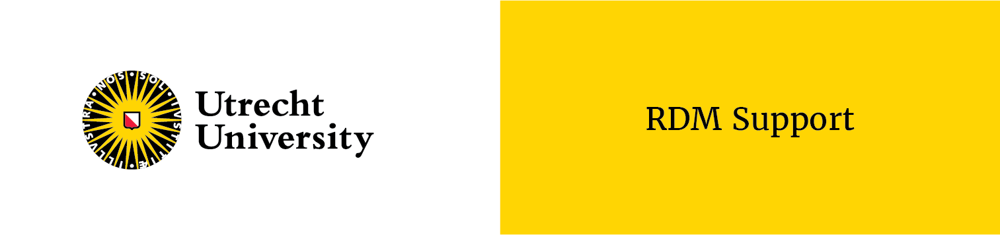

--- 
title: "Data Privacy Handbook"
author: "Utrecht University"
date: "`r Sys.Date()`"
site: bookdown::bookdown_site
documentclass: book
bibliography: [book.bib, packages.bib]
biblio-style: apalike
link-citations: yes
description: "The Data Privacy Handbook is being developed as a readable and practical resource for researchers and research support staff to address data privacy-related issues that come up during the research cycle."
---

# Welcome! {-}

```{r echo=FALSE}

```

The Data Privacy Handbook is a guide on handling personal data in scientific 
research, in line with European data protection and privacy regulations. It 
consists of:

- A **knowledge base** which explains how the EU General Data Protection Regulation (GDPR, Dutch: Algemene Verordening Gegevensbescherming)  applies to scientific research, including guidelines and good practices in carrying out GDPR-compliant scientific research; 
- An overview of privacy-enhancing **techniques & tools** and practical guidance on their implementation;
- **Use Cases** in the form of research projects with privacy-related issues, for which a reusable solution (e.g., tool, workflow) has been developed. 

The Data Privacy Handbook synthesizes information across various sources and 
presents it a *practical* and *actionable* format. This includes workflows, 
tools, and practical translations of the GDPR , which could be used by researchers 
and (data) support staff within Utrecht University and beyond. 

This is an Utrecht University (UU) community-driven, open-source project. 
You can visit our GitHub repository <a href="https://github.com/UtrechtUniversity/dataprivacyhandbook/" target="_blank">here</a>. 
We welcome feedback and contributions of any type, please read our 
<a href="https://github.com/UtrechtUniversity/dataprivacyhandbook/blob/main/CONTRIBUTING.md" target="_blank">contributing guidelines</a> 
for more information.

The Data Privacy Handbook is an initiative of 
<a href="https://www.uu.nl/en/research/research-data-management" target="_blank">Research Data Management Support</a> 
at the <a href="https://www.uu.nl/en/university-library"  target="_blank">Utrecht University Library</a>, 
in collaboration with privacy and data experts at Utrecht University. It is part of a larger Data Privacy Project, 
that aims to develop knowledge, tools, and experience on how researchers can and 
should deal with personal data. This project is funded by the Utrecht University 
Research IT Program and an NWO Digital Competence Center grant. You can read more 
about the Data Privacy Project <a href="https://utrechtuniversity.github.io/dataprivacyproject" target="_blank">here</a>.


## How to use this Handbook

The Data Privacy Handbook aims to make knowledge and solutions on handling personal 
data *Findable, Accessible, Interoperable, and Reusable* (FAIR) and present them in 
a practical and actionable format.   

The Handbook need not be read like a textbook. You are invited to navigate to the 
topic you need based on the table of contents, or use the guide below.


### What are you looking for?

I want to...:

<ul style="list-style: none;">
    <li>
        <details>
            <summary>Learn about the GDPR in the context of scientific research</summary>
            <ul>
                <li><a href="#gdpr">Introduction to the GDPR</a></li>
                <li><a href="#glossary">Definitions</a></li>
            </ul>
        </details>
    </li>
    <li>
        <details>
            <summary>Plan a GDPR-compliant research project</summary>
            <ul>
                <li><a href="#privacy-and-security-assessment">Assessing your design</a></li>
                <li><a href="#privacy-notices">Informing participants</a></li>
                <li><a href="#informed-consent-forms">Obtaining consent</a></li>
                <li><a href="#legal-documents">Collaborating on personal data</a></li>
            </ul>
        </details>
    </li>
    <li>
        <details>
            <summary>Work safely with personal data</summary>
            <ul>
                <li><a href="#data-storage">Storing personal data</a></li>
                <li><a href="#tools-and-services">Using GDPR-compliant tools and services</a></li>
                <li><a href="#privacy-enchancing-techniques">Reducing the sensitivity of personal data</a></li>
                <li><a href="#data-sharing">Sharing personal data during research</a></li>
            </ul>
        </details>
    </li>
    <li>
        <details>
            <summary>Share personal data with others</summary>
            <ul>
                <li><a href="#legal-basis">Sharing data legally</a></li>
                <li><a href="#data-sharing">Sharing personal data during research</a></li>
                <li><a href="#privacy-enchancing-techniques">Reducing the sensitivity of personal data</a></li>
                <li><a href="#tools-and-services">Using GDPR-compliant tools and services</a></li>
                <li><a href="#data-publishing">Publishing personal data</a></li>
                <li><a href="#data-transfer-agreement">Sharing personal data case by case</a></li>
            </ul>
        </details>
    </li>
    <li>
        <details>
            <summary>Learn from other projects</summary>
            <ul>
                <li><a href="#open-science-questionnaire">Publishing metadata only</a></li>
                <li><a href="#youth-pseudonymisation">Pseudonymising different types of data</a></li>
                <li><a href="#pet-survey">Minimising personal data processing in a survey</a></li>
            </ul>
        </details>
    </li>
    <li>
        <details>
            <summary>Get help or information</summary>
            <ul>
                <li><a href="#seeking-help">Getting help at Utrecht University</a></li>
                <li><a href="#glossary">Definitions</a></li>
                <li><a href="#references">References</a></li>
            </ul>
        </details>
    </li>
</ul>


## License and Citation

The Data Privacy Handbook is licensed under a <a href="https://creativecommons.org/licenses/by/4.0/" target="_blank">Creative Commons Attribution 4.0 International License</a>. You can view the license <a href="https://github.com/UtrechtUniversity/dataprivacyhandbook/blob/main/LICENSE.md" target="_blank">here</a>.


## Disclaimer

The content presented in the Data Privacy Handbook has been carefully curated by Research Data Management Support, 
in collaboration with privacy officers and data experts of Utrecht University.  

The Data Privacy Handbook is a ‘living’ book that is continually being written, updated and reviewed. Its contents can 
therefore change, or become outdated or redundant  . Hence, the information presented is provided “as is”, **without 
guarantees of accuracy or completeness**.  

As scientific research may differ depending on the discipline, topic, and context, measures needed or taken to ensure 
GDPR-compliance will vary across research projects. The authors can therefore **not be held responsible, nor accountable** 
for any negative consequences arising from interpretation and use of the content of the Data Privacy Handbook.  

The Handbook is not endorsed by the Board of Utrecht University   and does not constitute a mandatory directive. 
<b>For the most up-to-date and official/authoritative information, please refer to the 
<a href="https://www.uu.nl/en/research/research-data-management" target="_blank">university website</a> and 
<a href="https://intranet.uu.nl/en/knowledge-base/privacy-at-uu" target="_blank">intranet</a>, to which this Handbook is 
a hands-on, practical supplement</b>. Moreover, before implementing the guidance laid out in this Handbook, always seek 
the advice of your privacy officer or RDM Support to confirm the suitability of any proposed solution to your project.  

Throughout the Data Privacy Handbook, links to external webpages may be provided for additional information or assistance. 
The authors of the Data Privacy Handbook are **not responsible for the content of any such linked webpages**, nor is the 
content of external webpages necessarily endorsed by Utrecht University.  

Utrecht University is committed to sharing knowledge in line with the principles of open science and therefore welcomes 
readers from outside of the organization. However, the contents of the Data Privacy Handbook may not be in line with readers’ 
institutions’ policies or views. For more authoritative information, these readers’ should refer to resources from their own 
institutions.


## Contributions

The Data Privacy Handbook is a collaborative effort, made possible by a large number of contributors (also to be viewed 
in our <a href="https://github.com/UtrechtUniversity/dataprivacyhandbook" target="_blank">GitHub repository</a>):

Neha  Moopen, Dorien Huijser, Jacques Flores, Saskia van den Hout, Frans Huigen, Sanne Kleerebezem, Annemiek van der Kuil, 
Danny de Koning-van Nieuwamerongen, Frans de Liagre Böhl, Francisco Romero Pastrana, Ron Scholten, Garrett Speed, Robert 
Steeman, Liliana Vargas Meleza, Martine de Vos, and others.
  
Would you like to contribute to this Handbook yourself? Please read our 
<a href="https://github.com/UtrechtUniversity/dataprivacyhandbook/blob/main/CONTRIBUTING.md" target="_blank">Contributing Guidelines</a>.